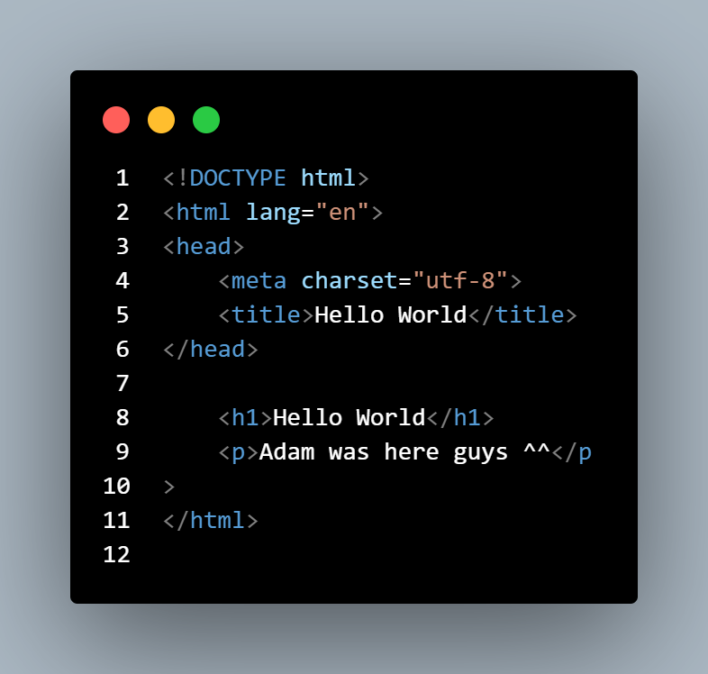
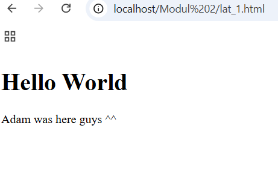

| Laboratorium | Modul 2
|-------|---------
| **NIM**   | 312310576
| **Nama** | Taufik Hidayat
| **Kelas** | TI.23.A6

#### Latihan 1

- Jalankan kode di atas tanpa menggunakan server, apa yang terjadi? Kemudian hapus tag, Amati apa yang terjadi? Lalu simpulkan !

 
Penjelasan :
HTML dapat dijalankan langsung di browser tanpa memerlukan server karena browser mampu membaca file HTML lokal. Jika tag <body> dihapus, browser tetap menampilkan konten karena secara otomatis memperbaiki struktur yang tidak lengkap. Namun, disarankan tetap menggunakan tag <body> agar struktur dokumen sesuai dengan standar HTML.

#### Latihan 2

Jalankan kode di atas dengan menggunakan server. Apa yang terjadi? Apakah ada perbedaan dengan Latihan1 ? Kemudian hapus tag, amati apa yang terjadi? Apakah ada perubahan dari sebelumnya ? Lalu simpulkan !
Penjelasan:
Ya, Tentu berubah dikarenakan h1 memiliki fungsi untung membuat font dari suatu huruf menjadi besar.

Latihan 3
 
Setelah menjalankan kode tersebut dengan method POST, maka gantikan dengan GET, lalulihatlah perbedaannya pada url di browser. Simpulkan!

Perbedaannya terletak pada visibilitas data di URL. POST lebih aman untuk data sensitif, sementara GET cocok untuk pengambilan data sederhana.
 
Latihan 4
 
Jelaskan alur pengiriman data dari form yang ada di file Lat2_2 dan file proses02 !

Form di Lat2_2 mengirim data melalui metode POST ke proses02.php saat tombol ditekan. Di proses02.php, data diperiksa dengan isset, lalu nilai input ditampilkan. Jika input kosong, hasilnya tetap ditampilkan tanpa nilai.

Latihan 5
Rubah kembali code pada file Lat2_4 dengan cara menghapus tulisan required pada baris 2 ! Jalankan code dan kosongi data input kemudian tekan tombol Input, apa yang terjadi ? Jelaskan apa fungsi dari kode required ?

Penjelasan: 
Setelah atribut required dihapus, form dapat dikirim meskipun input kosong, dan hasilnya menampilkan nama kosong di proses02.php. Fungsi required adalah memastikan input tidak boleh kosong sebelum form dikirim, dengan validasi langsung di browser.

Latihan 6

 

a)	Jalankan kode Lat2_2, dan kemudian amati yang terjadi ! Apakah ada perbedaan daripada sebelumnya ? Berilah penjelasan kenapa itu bisa terjadi ? 
b)	Menurut kalian dalam latihan 6 ini cara penulisan CSS apa yang dipakai ? 
c)	Rubahlah cara penulisan CSS ini dalam tipe linked style sheet !

a.	Ketika kode dijalankan, elemen-elemen HTML seperti <h1> dan 
 memiliki gaya (warna, font, ukuran, dsb.) yang diatur oleh CSS yang ditulis di dalam <style> pada bagian <head>. Tidak ada perbedaan kecuali Anda telah memodifikasi CSS atau strukturnya sebelumnya.
Penjelasan: 
Gaya diatur melalui CSS internal (embedded style). CSS ini memengaruhi elemen yang didefinisikan di dalam dokumen HTML yang sama, sehingga browser langsung membaca dan menerapkannya selama rendering.

b.	Dalam latihan 6 ini, tipe penulisan CSS yang digunakan adalah Internal CSS (atau Embedded CSS), karena deklarasi gaya ditulis langsung di dalam tag <style> pada bagian <head> dari file HTML.

c.	Ubah CSS menjadi Linked Style Sheet

 
 
 
Latihan 7
 
Penjelasan:
Ketika kode dijalankan, hasil operasi penjumlahan variabel x dan y (yaitu 5 + 2 = 7) ditampilkan di elemen dengan ID demo pada halaman. Baris 13 menggunakan document.getElementById("demo").innerHTML = z; untuk menampilkan nilai z (hasil operasi) ke dalam elemen 
 yang memiliki ID demo. Tanpa baris ini, hasil operasi tidak akan muncul di halaman, karena tidak ada instruksi untuk menampilkan output.

 
Latihan 8

 

Penjelasan:

a.	Saat kode dijalankan melalui server, hasilnya akan berjalan dengan baik karena browser menginterpretasi file HTML dan mengeksekusi JavaScript di dalamnya untuk mengonversi suhu antara Celcius dan Fahrenheit secara langsung saat pengguna mengetik angka.
b.	Ketika dijalankan tanpa server (misalnya hanya dengan membuka file HTML secara lokal), hasilnya tetap sama karena JavaScript dijalankan di sisi klien (browser). Tidak ada perbedaan fungsi, kecuali beberapa fitur JavaScript tertentu yang memerlukan server (misalnya, pengambilan data melalui HTTP).
c.	JavaScript bekerja sebagai bahasa pemrograman sisi klien yang memungkinkan interaktivitas pada halaman web, seperti memproses input pengguna dan memperbarui konten tanpa perlu memuat ulang halaman.
 
Latihan 9
 

 

Latihan 10

 
